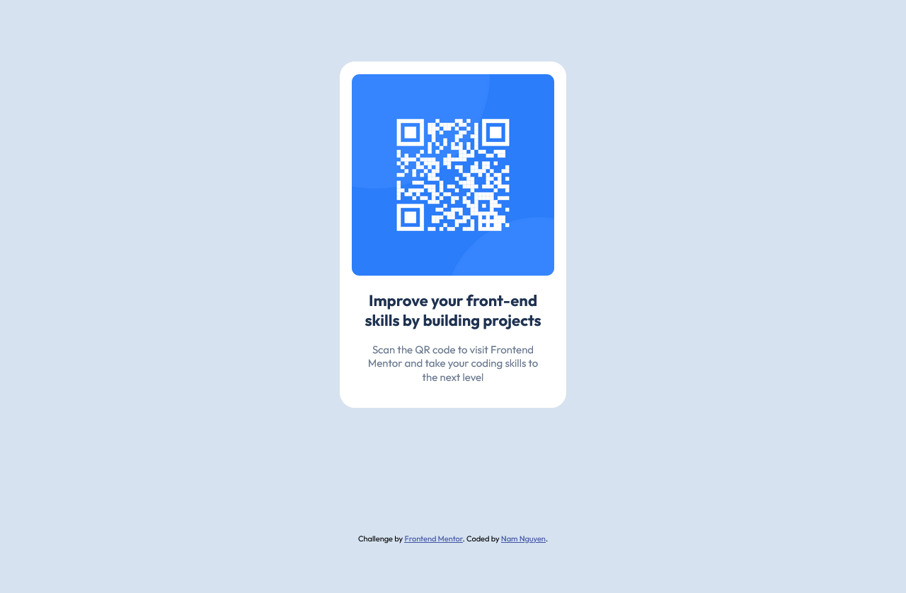

# Frontend Mentor - QR code component solution

This is a solution to the [QR code component challenge on Frontend Mentor](https://www.frontendmentor.io/challenges/qr-code-component-iux_sIO_H).

## Table of contents

- [Overview](#overview)
  - [Screenshot](#screenshot)
  - [Links](#links)
- [My process](#my-process)
  - [Built with](#built-with)
  - [What I learned](#what-i-learned)
  - [Continued development](#continued-development)
  - [Useful resources](#useful-resources)
- [Author](#author)
- [Acknowledgments](#acknowledgments)


## Overview
This is the first front-end challenge that I've attempted after learning HTML and CSS for a month. The task is to build out a QR code component for Front-end Mentor and to make it look as close to the original design as possible.
### Screenshot



### Links

- Solution URL: [Add solution URL here](https://your-solution-url.com)
- Live Site URL: [https://abigbroomstick.github.io/qr-code-component/](url)
## My process
I began by trying to visualize and break down the website's layout. Then I wrote the structure and elements in HTML and made sure they were semantically correct, which is for accessibility and SEO purposes.
Then I styled the components using CSS.

### Built with

- Semantic HTML5 markup
- CSS custom properties
- Flexbox
- CSS Grid
- Mobile-first workflow

### What I learned

This challenge helped reinforce my CSS knowledge and skills to use flexbox & grid layouts, typography, box shadow, border and text styling. Overall, I have gained experience in creating a cohesive and responsive design, applying modern CSS techniques, and ensuring the layout adapts well to different screen sizes and devices.


```html I am proud of :D
   <section class="qr-container">
      
      <h1>Improve your front-end skills by building projects</h1>
      <p>Scan the QR code to visit Frontend Mentor and take your coding skills to the next level</p>
    </section>
      
```
```css I am proud of :D
body {
    background-color: hsl(212, 45%, 89%);
    font-size: 15px;
    font-family: "Outfit", sans-serif;
    -webkit-text-size-adjust: none;
    text-size-adjust: none;
    display: grid;
    place-items: center;
    height: 100vh;
}

.qr-container {
    background-color: white;
    display: flex;
    flex-direction: column;
    flex-wrap: wrap;
    max-width: 320px;
    padding: 1.075rem;
    margin: 1.075rem;
    border-radius: 1.35rem;
    box-shadow: 0 1.6rem 1.6rem hsla(0, 0%, 0%, 01.35rem);
    text-align: center;
}
```

### Continued development

I will try to refine my skills using flexbox and grid layout more after this challenge!!!


### Useful resources

- [Learn Flexbox in 15 minutes](https://youtu.be/fYq5PXgSsbE?si=iH-V5ouAmqPMFM52) - This is an amazing video which helped me finally understand how to style flexbox. I'd recommend it to anyone still learning this concept.


## Author

- Github - [@abigbroomstick](https://github.com/abigbroomstick)
- Frontend Mentor - [@abigbroomstick](https://www.frontendmentor.io/profile/abigbroomstick)
- Facebook - [@Nam Nguyen](https://www.facebook.com/nam.nguyenbathanh/)


## Acknowledgments

Ashleynguci- she gave me huge motivation to learn web development :D
Colt Steele- best Udemy Front-End class I've taken so far
Nheo Hi- my lovely girlfriend who puts up with me every time I stayed up late to code.

